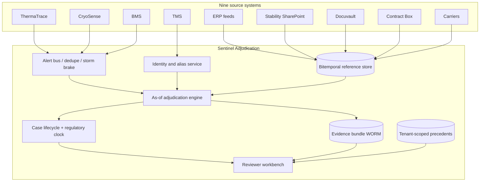

# Architecture diagram

```mermaid
flowchart TB
  subgraph sources [Nine source systems]
    S1[ThermaTrace]
    S2[CryoSense]
    S3[BMS]
    S4[TMS]
    S5[ERP feeds]
    S6[Stability SharePoint]
    S7[Docuvault]
    S8[Contract Box]
    S9[Carriers]
  end

  subgraph core [Sentinel Adjudication]
    A[Alert bus / dedupe / storm brake]
    I[Identity and alias service]
    R[(Bitemporal reference store)]
    E[As-of adjudication engine]
    C[Case lifecycle + regulatory clock]
    V[(Evidence bundle WORM)]
    P[(Tenant-scoped precedents)]
    W[Reviewer workbench]
  end

  S1 & S2 & S3 --> A
  S4 --> I
  S5 & S6 & S7 & S8 --> R
  S9 --> R
  A --> E
  I --> E
  R --> E
  E --> C
  E --> V
  C --> W
  V --> W
  P --> W
```

Boundary rule: the engine never calls SharePoint/Docuvault/Box directly — only the reference store snapshot as-of the relevant dates.
