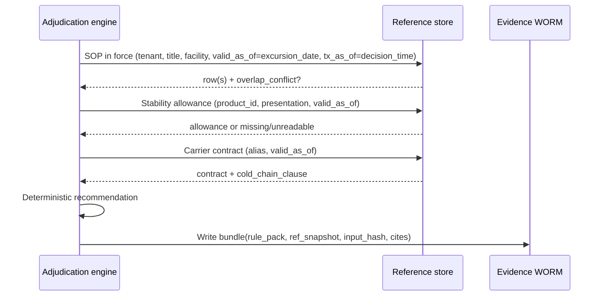

# As-at / bitemporal query

```mermaid
sequenceDiagram
  participant Eng as Adjudication engine
  participant Ref as Reference store
  participant Ev as Evidence WORM

  Eng->>Ref: SOP in force (tenant, title, facility, valid_as_of=excursion_date, tx_as_of=decision_time)
  Ref-->>Eng: row(s) + overlap_conflict?
  Eng->>Ref: Stability allowance (product_id, presentation, valid_as_of)
  Ref-->>Eng: allowance or missing/unreadable
  Eng->>Ref: Carrier contract (alias, valid_as_of)
  Ref-->>Eng: contract + cold_chain_clause
  Eng->>Eng: Deterministic recommendation
  Eng->>Ev: Write bundle(rule_pack, ref_snapshot, input_hash, cites)
```

Re-adjudication after TT-CB-114: same `valid_as_of`, new `tx_as_of`, corrected temps, **new** bundle linked to prior.
