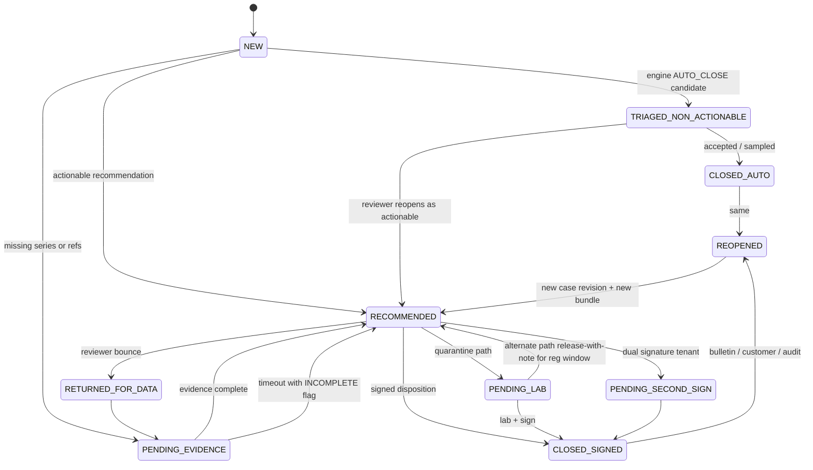

# Case lifecycle

```mermaid
stateDiagram-v2
  [*] --> NEW
  NEW --> TRIAGED_NON_ACTIONABLE: engine AUTO_CLOSE candidate
  NEW --> PENDING_EVIDENCE: missing series or refs
  NEW --> RECOMMENDED: actionable recommendation
  TRIAGED_NON_ACTIONABLE --> CLOSED_AUTO: accepted / sampled
  TRIAGED_NON_ACTIONABLE --> RECOMMENDED: reviewer reopens as actionable
  PENDING_EVIDENCE --> RECOMMENDED: evidence complete
  PENDING_EVIDENCE --> RECOMMENDED: timeout with INCOMPLETE flag
  RECOMMENDED --> RETURNED_FOR_DATA: reviewer bounce
  RECOMMENDED --> PENDING_LAB: quarantine path
  RECOMMENDED --> PENDING_SECOND_SIGN: dual signature tenant
  RECOMMENDED --> CLOSED_SIGNED: signed disposition
  RETURNED_FOR_DATA --> PENDING_EVIDENCE
  PENDING_LAB --> CLOSED_SIGNED: lab + sign
  PENDING_LAB --> RECOMMENDED: alternate path release-with-note for reg window
  PENDING_SECOND_SIGN --> CLOSED_SIGNED
  CLOSED_SIGNED --> REOPENED: bulletin / customer / audit
  CLOSED_AUTO --> REOPENED: same
  REOPENED --> RECOMMENDED: new case revision + new bundle
```

Regulatory deadline is attached at NEW and never cleared on transitions.
